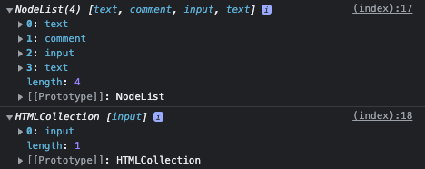

* TOC
{:toc}

# Web Basic 
## HTML
`HTML (Hyper Text Markup Language)`은 웹을 이루는 가장 기초적인 구성 요소로 웹
컨텐츠의 의미와 구조를 정의 할때 사용. 프로그래밍 언어가 아닌 컨텐츠의 구조를
정의하는 마크업 언어이다. HTML은 다양한 컨텐츠 표현을 위해 마크업이 사용된다.

`Hypertext`는 웹 페이지를 다른 페이지로 연결하는 링크를 의미

`Markup Language`는 택스트가 아닌 태그를 이용하여 구조적으로 표현하는 언어

```html
<nav id="navbar">
  <ul>
    <li>item1<li> 
    <li>item2<li> 
  </ul>
</nav>
```
위 마크업은 opening tag, closing tag로 구성되며 nav는 `tag` id, class는
`attribute` nav의 children node는 ul이고 ul의 parent node는 nav이다. li는 서로
sibling node라 부른다. (root로 시작해 leaf node로 끝남)
li 태그의 item1은 `content`라로 표현한다. element는 opening + closing tag +
content를 의미한다.


## DOM


`DOM (Document Object Model)`은 HTML Documents의 programming interface이다.
DOM은 structured representation을 제공하며 프로그래밍 언어가 DOM에 접근할수 있는 방법을 제공하여 그들이 문서 구조, 스타일, 내용등을 변경할 수 있게 돕는다.
DOM은 웹페이지의 객체지향 표현이며 자바스크립트와 같은 스크립팅 언어를
이용하여 DOM을 수정할 수 있다.

```html
<!DOCTYPE html>
<html lang="en">
  <head>
    <title>HTML Basic</title>
    <meta charset="UTF-8" content="us" />
    <meta name="viewport" content="width=device-width, initial-scale=1" />
  </head>
  <body>
    <div>
      div section<!-- comments--><input type="text" value="hello html" />
    </div>
  </body>
</html>

<script>
  const selector = document.querySelector("div");
  console.log(selector.childNodes);
  console.log(selector.children);
</script>
```


[DOM Node와 Element 차이](https://velog.io/@yejineee/DOM%EC%9D%80-%EB%AC%B4%EC%97%87%EC%9D%B8%EA%B0%80-DOM-Node%EC%99%80-Element%EC%9D%98-%EC%B0%A8%EC%9D%B4)


## Browser Engine 
- [chromium](https://www.chromium.org/blink/)
- [webkit](https://webkit.org/)
- [Gecko](https://en.wikipedia.org/wiki/Gecko_(software))

## Browser Rendering

랜더링의 기본적인 동작 과정은 다음과 같다.
1. HTML 파일과 CSS 파일을 파싱해서 각각 Tree를 만든다. (Parsing)
1. 두 Tree를 결합하여 Rendering Tree를 만든다. (Style)
1. Rendering Tree에서 각 노드의 위치와 크기를 계산한다. (Layout)
1. 계산된 값을 이용해 각 노드를 화면상의 실제 픽셀로 변환하고, 레이어를 만든다. (Paint)
1. 레이어를 합성하여 실제 화면에 나타낸다. (Composite)

[출처](https://tecoble.techcourse.co.kr/post/2021-10-24-browser-rendering/)

## 번외
HTML은 [w3c](https://www.w3.org/groups/wg/), JavaScript(ecma script)는 [ecma international](https://www.ecma-international.org/about-ecma/organisation/)

## Semantic Tag
-- TODO: 여기야


# Generated Tags

## tag-example

- [[asd](asd)](index#haekyus-wiki#asdasd)
